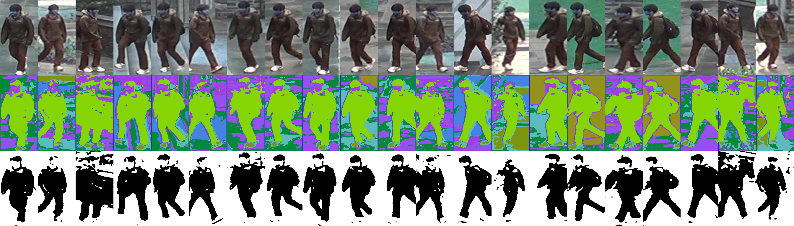

# Human Co-Parsing Guided Alignment for Occluded Person Re-identification  (IEEE T-IP 2023)
This is the Pytorch implementation of the [paper](https://ieeexplore.ieee.org/abstract/document/9994734). More information about the paper is in [here](https://shuguang-52.github.io/hcga/).
<div align="center">
   
</div>

<div align="center">
   
</div>

We propose a novel Human Co-parsing Guided Alignment (HCGA) framework that alternately trains the **human co-parsing** network and the ReID network, where the human co-paring network is trained in a *weakly supervised manner* to obtain paring results without any extra annotation.

<p align="center">

</p>

## Installation

Clone this repository and install its requirements.
```bash
conda create -n hcga
conda activate hcga
conda install -c pytorch faiss-gpu

# For RTX 3090 and Tesla A100, we use CUDA 11.1.
pip install torch==1.10.1+cu111 torchvision==0.11.2+cu111 torchaudio==0.10.1 -f https://download.pytorch.org/whl/torch_stable.html

git clone https://github.com/Vill-Lab/2022-TIP-HCGA
cd 2022-TIP-HCGA
pip install -r requirements.txt
```

## Reproducing the results

1) Prepare the ReID datasets


2) Download the pre-trained [HRNet32](https://arxiv.org/abs/1902.09212) on ImageNet from [Model](https://pan.baidu.com/s/1L-CLWFX-8BJl9m6XAjB1GA), code: r1o2.

3) The following command will train HCGA on Occluded-Duke.

```bash
bash HCGA-OD.sh
```
Note: use GPU multi-process need large memory and GPU Memory (We use RTX 3090 with 24GB).

4) Test

```bash
bash Test-OD.sh
```


## Reference
We hope that this technique will benefit more computer vision related applications and inspire more works.
If you find this technique and repository useful, please cite the paper. Thanks!

```
@article{hcga23tip,
  author={Dou, Shuguang and Zhao, Cairong and Jiang, Xinyang and Zhang, Shanshan and Zheng, Wei-Shi and Zuo, Wangmeng},
  journal={IEEE Transactions on Image Processing}, 
  title={Human Co-Parsing Guided Alignment for Occluded Person Re-Identification}, 
  year={2023},
  volume={32},
  pages={458-470},
  doi={10.1109/TIP.2022.3229639}}
```

